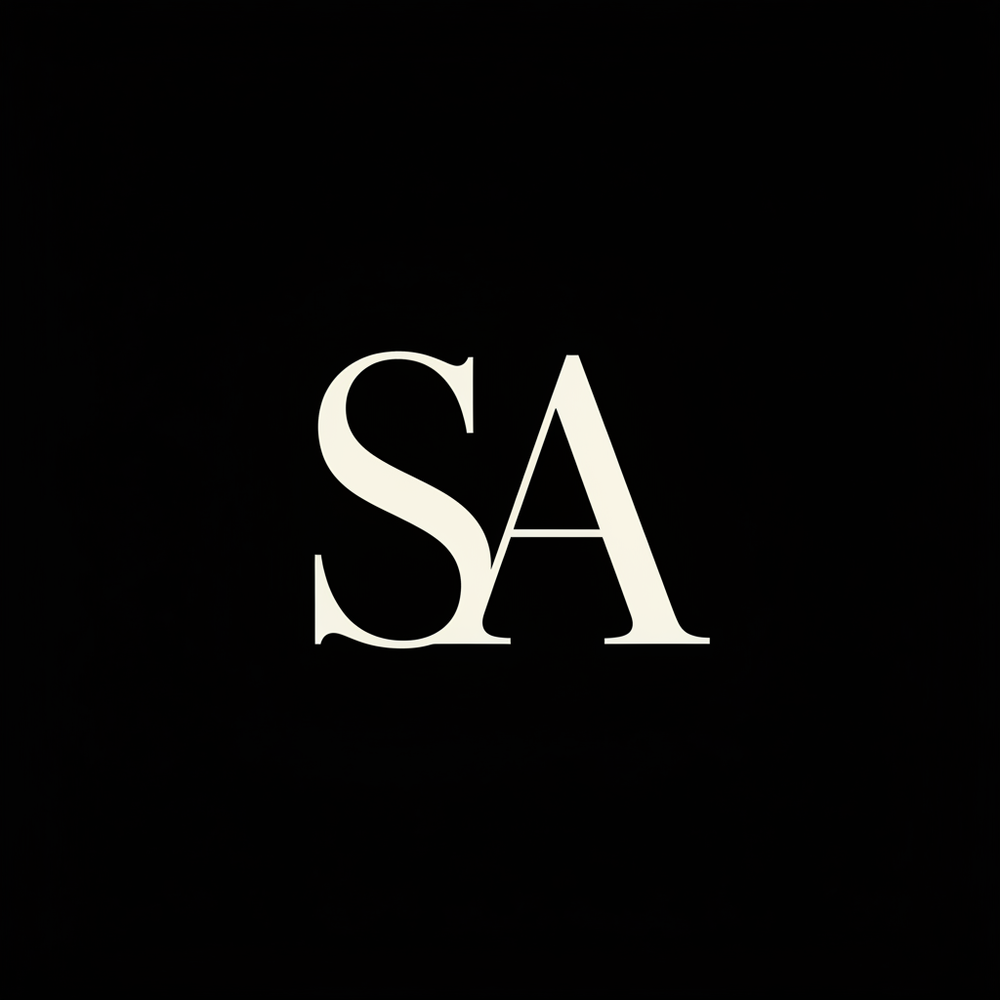

# Sara AlShammari - Portfolio

A modern, responsive personal portfolio website built with Flask and Tailwind CSS. This portfolio showcases my work as a Software Engineer, featuring my projects, skills, and professional experience.

## ✨ Features

- **Responsive Design** - Fully responsive layout that works on all devices (mobile, tablet, desktop)
- **Dark Theme** - Modern dark theme with yellow accent colors
- **Interactive Projects** - Click on project cards to view detailed information in a modal
- **Project Status Indicators** - "Under Development" overlay for work-in-progress projects
- **Smooth Scrolling** - Smooth navigation between sections
- **Mobile-Friendly Navigation** - Hamburger menu for mobile devices
- **No Database Required** - All data is stored in Python dictionaries
- **Easy to Customize** - Update content by simply editing the Python data structures

## 🚀 Technologies Used

- **Backend**: Flask (Python)
- **Frontend**: HTML5, Tailwind CSS, JavaScript
- **Fonts**: Google Fonts (Manrope, Noto Serif)
- **Icons**: Material Symbols

## 📁 Project Structure
